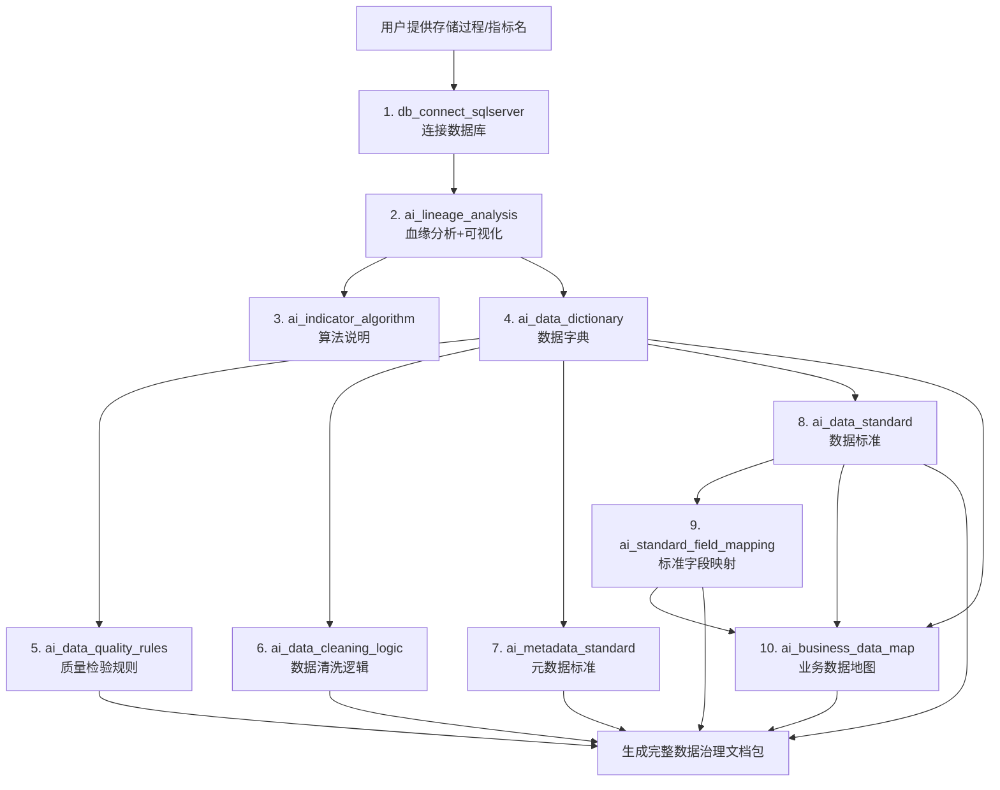

# AI Data Governance Skills (AI 数据治理技能库)

本仓库包含 11 个 AI 技能模块，用于自动化完成指标数据治理全流程，包括血缘分析、数据字典、数据标准、业务数据地图等。

---

## 目录
- [功能概览](#功能概览)
- [技能清单](#技能清单)
- [完整工作流程](#完整工作流程)
- [环境要求](#环境要求)
- [使用示例](#使用示例)

---

## 功能概览

本技能库提供完整的数据治理自动化能力，支持从单指标分析到全文档生成的一站式服务。核心能力：
- 自动提取存储过程并递归分析血缘
- 自动生成数据字典、数据标准、元数据标准
- 自动生成数据质量检验规则和数据清洗逻辑
- 自动生成业务数据地图（43列×5区域的标准模板）
- 支持 SQL Server 数据库连接和跨库表处理

---

## 技能清单

| 序号 | 技能目录 | 技能名称 | 功能描述 | 依赖技能 | 输出格式 |
|------|----------|----------|----------|----------|----------|
| 1 | [ai_indicator_arrange](./ai_indicator_arrange/) | 指标数据治理编排 | 总编排技能，根据用户提供的存储过程/指标名，自动调用所有子技能完成全流程生成 | 全部技能 | Excel/MD 文档集合 |
| 2 | [ai_lineage_analysis](./ai_lineage_analysis/) | 血缘分析与算法 | 对指定存储过程进行字段级血缘分析，追溯到源头表，同步生成 Mermaid 可视化图表 | db_connect_sqlserver | .md（含 Mermaid 图） |
| 3 | [ai_indicator_algorithm](./ai_indicator_algorithm/) | 逻辑算法说明 | 以开发和业务人员都能理解的方式描述指标计算逻辑，提供举例说明 | ai_lineage_analysis | .md |
| 4 | [ai_data_dictionary](./ai_data_dictionary/) | 数据字典 | 生成完整的数据字典 Excel，包含所有表的字段信息、中文名映射、英文字段转小写 | ai_lineage_analysis | .xlsx + .md |
| 5 | [ai_data_quality_rules](./ai_data_quality_rules/) | 数据质量检验规则 | 基于数据字典生成可直接执行的数据质量检验 SQL 规则 | ai_data_dictionary | .md |
| 6 | [ai_data_cleaning_logic](./ai_data_cleaning_logic/) | 数据清洗逻辑 | 基于血缘和数据字典生成可执行的数据清洗 SQL 脚本 | ai_lineage_analysis, ai_data_dictionary | .md |
| 7 | [ai_metadata_standard](./ai_metadata_standard/) | 元数据标准 | 基于数据字典生成元数据管理标准文档 | ai_data_dictionary | .xlsx |
| 8 | [ai_data_standard](./ai_data_standard/) | 数据标准 | 基于数据字典生成业务级数据标准，同义词合并为一条标准，英文术语规范为小写+下划线 | ai_data_dictionary | .xlsx |
| 9 | [ai_standard_field_mapping](./ai_standard_field_mapping/) | 数据标准字段映射 | 将数据标准术语映射到数据字典每个字段，通过同义词确保 100% 映射率 | ai_data_dictionary, ai_data_standard | .xlsx |
| 10 | [ai_business_data_map](./ai_business_data_map/) | 业务数据地图 | 生成 43 列×5 区域的标准业务数据地图 Excel，覆盖数据流程、安全、质量、标准、元数据 | ai_data_dictionary, ai_data_standard, ai_standard_field_mapping | .xlsx |
| 11 | [db_connect_sqlserver](./db_connect_sqlserver/) | SQL Server 连接 | 连接 SQL Server 数据库，提供连接测试和代码复用 | - | 连接脚本 |

---

## 完整工作流程

使用 [ai_indicator_arrange](./ai_indicator_arrange/) 技能进行全流程编排：



### 各步骤输出示例
1. **血缘分析** → `{指标名}血缘分析与指标算法.md` + `{指标名}血缘思维导图.md`
2. **算法说明** → `{指标名}逻辑算法说明.md`
3. **数据字典** → `{指标名}数据字典.xlsx` + `{指标名}数据字典.md`
4. **质量规则** → `{指标名}数据质量检验规则.md`
5. **清洗逻辑** → `{指标名}数据清洗逻辑.md`
6. **元数据标准** → `{指标名}元数据标准.xlsx`
7. **数据标准** → `{指标名}数据标准.xlsx`
8. **标准字段映射** → `{指标名}数据标准字段映射.xlsx`
9. **业务数据地图** → `{指标名}业务数据地图.xlsx`

---

## 环境要求

### Python 环境
- Python 3.7+
- 需安装的库：
  - `openpyxl` - Excel 生成
  - `pyodbc` - SQL Server 连接
  - `sqlparse` - SQL 解析（可选）

```bash
pip install openpyxl pyodbc
```

### 数据库
- SQL Server 2014+
- 需提供 IP、用户名、密码、数据库名

### 编辑器（查看 Mermaid 图）
- VS Code + Mermaid 插件
- Typora
- GitHub（支持 Mermaid 渲染）

---

## 使用示例

### 示例1：全量调用（推荐）

你只需要：
1. 提供存储过程名称或指标名称
2. 提供数据库连接信息（IP/用户名/密码/数据库名）

技能会自动按顺序完成全部 9 步，生成所有文档。

### 示例2：单独调用某技能

如果你只需要特定文档，可以单独调用：
- 只要血缘分析 → 调用 `ai_lineage_analysis`
- 只要算法说明 → 调用 `ai_indicator_algorithm`
- 只要数据字典 → 调用 `ai_data_dictionary`
- 只要质量规则 → 调用 `ai_data_quality_rules`
- 只要清洗逻辑 → 调用 `ai_data_cleaning_logic`
- 只要数据标准 → 调用 `ai_data_standard`

---

## 数据安全与合规

- 本技能库支持数据分级标注（公共/内部/敏感/机密）
- 支持数据脱敏规则识别（姓名/金额/账户等字段自动识别）
- 所有代码不记录密码等敏感信息
- 所有英文字符统一转为小写，确保命名一致性

---

## 支持的业务域

标准业务域（业务数据地图使用）：
项目域、研发域、销售域、生产域、采购域、仓库域、质量域、人事域、财务域、综合管理域、市场域

---

## 后续计划

- [ ] 支持更多数据库类型（MySQL、PostgreSQL）
- [ ] 增加实时数据地图更新功能
- [ ] 优化血缘分析性能（处理超长存储过程）
- [ ] 增加数据血缘可视化 Web UI
- [ ] 支持从 Excel 批量导入字典

---

## 许可证

本仓库技能仅供内部数据治理使用。
